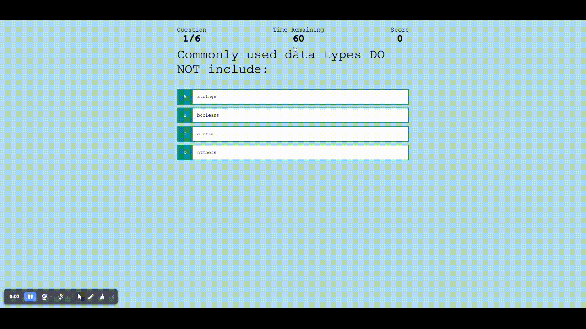

# JavaScript-Timed-Quiz

Bootcamp Challenge 04 - Web API's: A timed quiz on coding

## The Challenge

Create a timed quiz based on JavaScript fundamentals that stores high scores that can gauge the progress of those who takes the quiz.

Acceptance Criteria for the webpage:
- While on the homepage of the quiz, I will be able to click the start button and a timer will start counting down and I will be presented with a question
- Once I answer that question, another question will should be presented, and if I answer incorrectly, time will be reduced
- When all questions are answered or the timer reaches 0 the quiz/game is over
- Once the game is over, I can save over my initials and my score

## Mock-Up

## The Process

To meet the acceptance criteria, the following had to be done:
- understanding JavaScript terminology well enough to navigate through the how's and why's behind JavaScript codes/terms
- extensive research on applying all lessons learned on JavaScript
- troubleshoot the smallest issues to get the basic functionality working

## URL's

- Deployed Application URL: https://derricn2.github.io/JavaScript-Timed-Quiz/highscores.html
- Github URL: https://github.com/derricn2/JavaScript-Timed-Quiz.git

## Sites

- [appendChild()](https://developer.mozilla.org/en-US/docs/Web/API/Node/appendChild)
- [addEventListener()](https://developer.mozilla.org/en-US/docs/Web/API/EventTarget/addEventListener)
- [Building Blocks](https://developer.mozilla.org/en-US/docs/Learn/JavaScript/Building_blocks/Events#event_delegation)
- [createElement()](https://developer.mozilla.org/en-US/docs/Web/API/Document/createElement)
- [Data Attributes](https://developer.mozilla.org/en-US/docs/Learn/HTML/Howto/Use_data_attributes)
- [Document](https://developer.mozilla.org/en-US/docs/Web/API/Document)
- [Events](https://developer.mozilla.org/en-US/docs/Learn/JavaScript/Building_blocks/Events)
- [event:preventDefault()](https://developer.mozilla.org/en-US/docs/Web/API/Event/preventDefault)
- [JSON.stringify()](https://developer.mozilla.org/en-US/docs/Web/JavaScript/Reference/Global_Objects/JSON/stringify)
- [KeyboardEvent](https://developer.mozilla.org/en-US/docs/Web/API/KeyboardEvent)
- [localStorage](https://developer.mozilla.org/en-US/docs/Web/API/Window/localStorage)
- [querySelectorAll()](https://developer.mozilla.org/en-US/docs/Web/API/Document/querySelectorAll)
- [setAttribute()](https://developer.mozilla.org/en-US/docs/Web/API/Element/setAttribute)
- [setInterval()](https://developer.mozilla.org/en-US/docs/Web/API/setInterval)
- [Style Property](https://developer.mozilla.org/en-US/docs/Web/API/HTMLElement/style)
- [Web Storage API](https://developer.mozilla.org/en-US/docs/Web/API/Web_Storage_API/Using_the_Web_Storage_API)
- [Window](https://developer.mozilla.org/en-US/docs/Web/API/Window)
